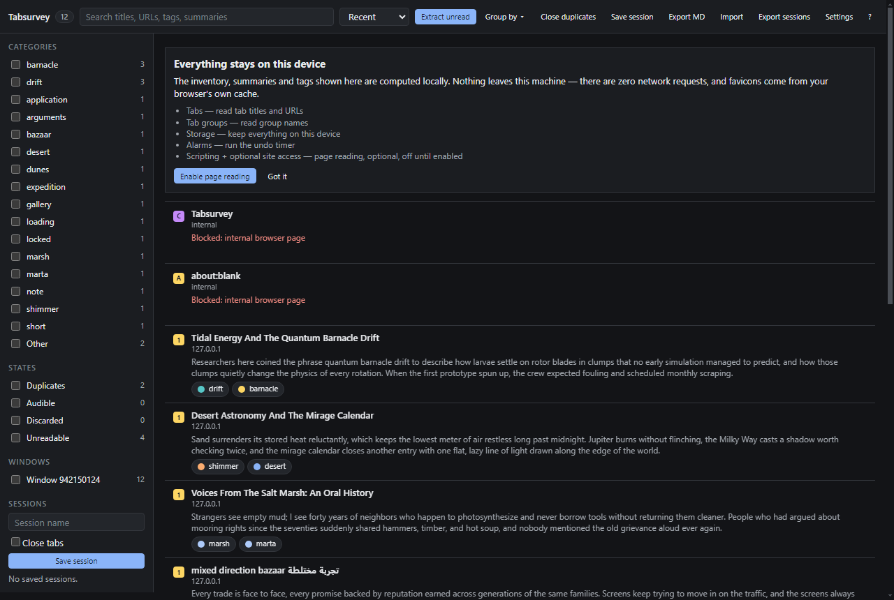

# Tabsurvey

Tabsurvey is a Manifest V3 browser extension for people who keep sixty tabs open and need to see what they actually have: it inventories every open tab, extracts the main page content, produces a short summary, assigns editable tags, and finds duplicates — entirely on your device.

**Everything runs locally. The extension makes zero network requests — no APIs, no analytics, no telemetry, no CDN assets, ever.** Summaries are computed by a deterministic extractive algorithm inside the extension; tags come from inspectable rules you can correct; favicons come from your browser's own cache. A regression test scans the source to enforce this, and the dashboard verifies at runtime that it loads no non-local resources.



## Permissions, and why each exists

| Permission | Why |
|---|---|
| `tabs` | Read titles, URLs, and tab state (audible, discarded, pinned) across windows. This is the inventory. |
| `tabGroups` | Show group membership and create native browser groups from tags or domains. |
| `storage` | Persist the inventory, settings, sessions, and tag corrections on your device (`chrome.storage.local` only). |
| `alarms` | Run the undo countdown for bulk close so it survives service-worker termination. |
| `favicon` | Serve tab favicons in the popup/dashboard from the browser's own cache via `_favicon`. |
| `scripting` | Inject the local extraction script into pages you permit (below). |
| `http://*/*`, `https://*/*` (**optional**) | Host access is **off by default**. Page reading — and therefore summaries — only works after you click "Enable page reading". Without it, everything else still works and rows show an honest "No host permission granted" state instead of fake summaries. |

## Install (load unpacked)

1. Install Node.js 18+ (only needed to run the test suite; the extension itself has no build step) — or skip straight to step 2.
2. Download this repository (`Code → Download ZIP`, or `git clone https://github.com/TheFadGhost/tabsurvey.git`) and unzip it.
3. Open `chrome://extensions`.
4. Turn on **Developer mode** (top right).
5. Click **Load unpacked** and select the unzipped folder (the folder containing `manifest.json`).
6. Optional but recommended: open the Tabsurvey dashboard and click **Enable page reading** to allow on-device content extraction.
7. Pin Tabsurvey from the puzzle-piece menu. Shortcuts: `Alt+Shift+T` popup, `Alt+Shift+S` dashboard (customize at `chrome://extensions/shortcuts`). Type `ts` plus your search in the address bar for omnibox search.

Requires Chrome/Chromium 116+ (or any Chromium derivative with MV3 support: Edge, Brave, Arc…). Not tested on Firefox (MV3 differences).

## Usage

- **Popup** — instant list of all tabs across windows: search, filter by duplicates/audible/unreadable/category, click a row to focus that tab.
- **Dashboard** — full inventory with per-tab summaries and tags, sort and multi-filter (category, state, window), bulk select with close/discard/group actions, close duplicates, save and restore named sessions, export the whole inventory as Markdown, import/export sessions as JSON, per-theme settings (light/dark/high-contrast/system), summary length, undo window length, and a per-domain extraction opt-out.
- **Keyboard** — `/` search · `j`/`k` or arrows move · `Enter` focus tab · `x` select · `d` duplicates filter · `g` group menu · `s` save session · `?` shortcut overlay · `Esc` close/clear.

### How summarization works (and its limits)

Summaries are **extractive**: sentences are scored locally with TF-IDF term weights plus positional decay and heading/title-overlap bonuses, then selected greedily with a redundancy penalty so repeated marketing fluff doesn't dominate. The top sentences are returned in original order. That means a summary is always a faithful subset of the page text — no paraphrase, no invention — but also no abstraction beyond what the page says. Pages with very little text are marked *low confidence* rather than summarized confidently, and unreadable pages say exactly why (`chrome://`-style internal pages, PDFs, image-only pages, paywall stubs, SPA shells with no server-rendered text, excluded domains, missing host permission).

Quality is tracked by a committed benchmark: six synthetic fixtures with reference summaries, scored by token-unigram F1 between produced abstracts and references (current mean ≈ 0.37, floor 0.30 enforced by test), plus a determinism test asserting identical output run-to-run.

### How tagging works

Tags come from transparent rules over domain, title words, URL patterns, and frequent terms — e.g. a GitHub URL becomes "Development" with the reason shown right in the chip tooltip. You can remove or add tags per tab; removals are remembered and respected, additions re-applied, persisted locally. There is no ML model and nothing leaves the device.

### Sessions

Save any selection (or all tabs) as a named session, optionally closing them, restore later, and export/import sessions as JSON. Everything stays in `chrome.storage.local`.

## Architecture

- `src/background/serviceWorker.js` → thin entry wiring `controller.js` (all state machine logic, testable against a fake `chrome` in `tests/fakes/fakeChrome.js`). The worker holds no long-lived in-memory truth: every mutation persists through `chrome.storage.local`, listeners re-register at top level, staged closes finalize via `chrome.alarms`, and hydration reconciles with live `chrome.tabs.query()` on revival.
- `src/content/extractor.js` → self-contained readability-style extractor (no dependencies): prunes boilerplate/cookie banners, scores paragraph density, returns plain text + headings + description with a stated 20 000-character cap. All page data is treated as untrusted; the UI renders it exclusively through `textContent`.
- `src/lib/*` → pure modules with zero browser dependencies: `summarizer.js` (TF-IDF + MMR selection), `tagger.js` (rules + corrections), `dedupe.js` (tracking-parameter/fragment-insensitive URL normalization), `searchIndex.js`, `exporters.js`, `textUtils.js`, `schema.js` (shared contracts).
- `src/popup`, `src/dashboard` → dependency-free HTML/CSS/JS using design tokens from `DESIGN.md`; themes are pure variable overrides with a synchronous localStorage mirror so the popup never flashes the wrong theme.

## Tests

```
npm install
npm test          # 90 unit + integration tests (node:test)
npm run e2e       # loads both builds in headless Chrome via CDP; requires Chrome
                  # for Testing; set CHROME_BIN if your binary lives elsewhere
```

The suite covers summarization determinism and the quality benchmark, extraction against a synthetic fixture corpus (SPA shell, cookie-banner article, image-only page, paywall stub, hostile markup — graceful failure asserted where extraction is impossible), tagging precedence and correction learning, duplicate detection including tracking-parameter variants, service-worker lifecycle across simulated termination, storage-quota pruning, the bulk-close undo window, session round-trips, and a static gate asserting zero network-capable code in anything that ships. All fixtures are original synthetic pages written for this repository.

## License

MIT. See [LICENSE](LICENSE).
